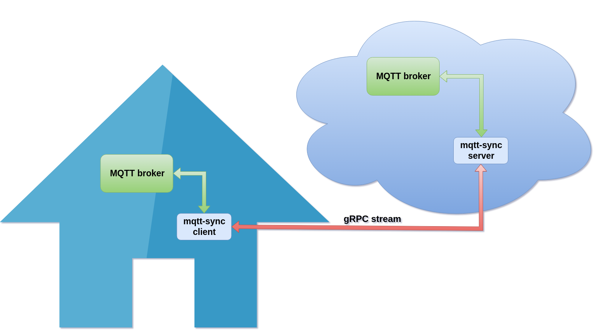

# mqtt-sync

The application is designed to merge two MQTT brokers via a secure connection, which is particularly useful when automating smart home devices using the Zigbee2MQTT protocol. This solution allows you to synchronize data between two networks: one local (home network), where direct access from outside is not possible, and another external (VPS server on the internet).



## How it works

1. Home Network:
   In the home network, a client is installed that connects to the local MQTT broker. This broker manages smart home devices through the Zigbee2MQTT protocol. Since direct communication with the outside world is difficult (e.g., no possibility of port forwarding), an additional communication channel over the internet is used.

2. gRPC Server:
   On the remote server (VPS), a gRPC server is deployed, which is also connected to its own MQTT broker. This server acts as a bridge between the home client and external services or applications.

3. Data Synchronization:
   The client in the home network establishes a bidirectional streaming channel (bidirectional gRPC stream) with the server on the VPS. For security purposes, this channel uses TLS encryption. All messages received by either of the two MQTT brokers (local and external) are automatically transmitted to the opposite broker via this secure channel.

4. Automation and Control:
   Thanks to this architecture, all smart home devices can receive commands and send information regardless of whether requests come from within the internal network or from the internet. For example, a user can control their devices through a mobile app even while away from home without needing to set up complex VPN connections or port forwarding.

## Install

```
# Run server and client by docker-compose
make run

# Run only server by docker-compose
make server

# Run only client by docker-compose
make client
```